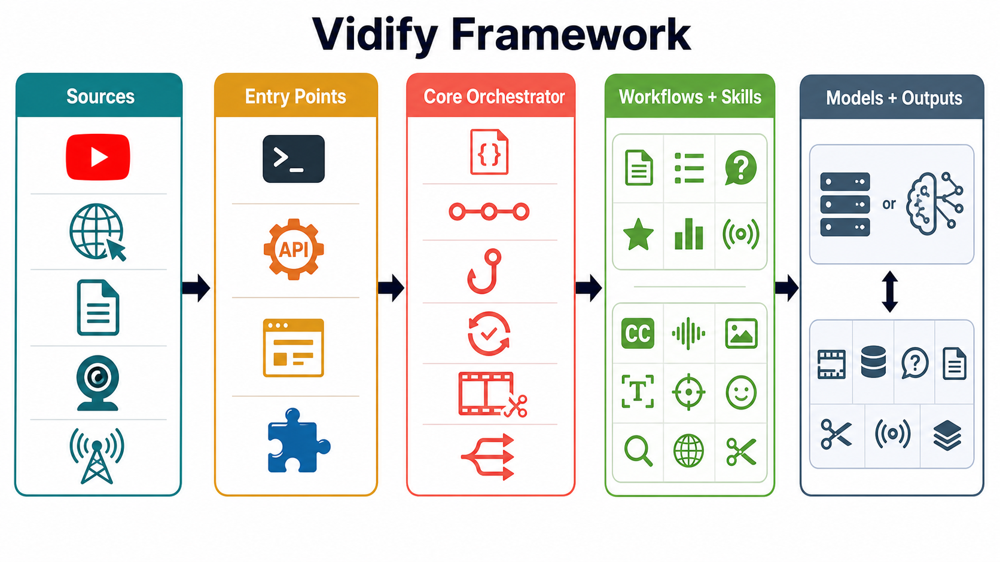
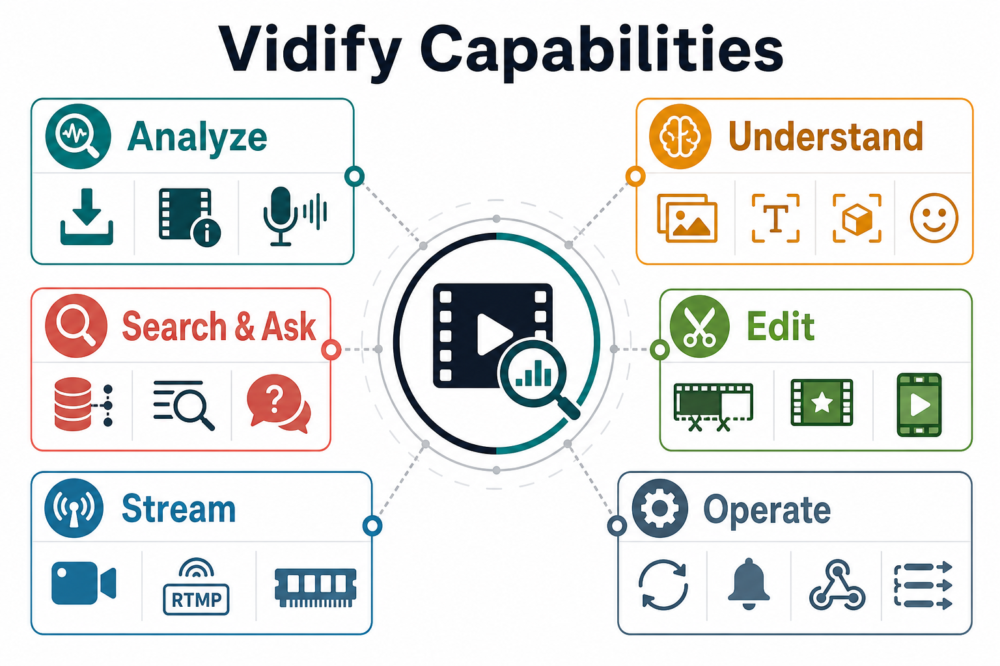
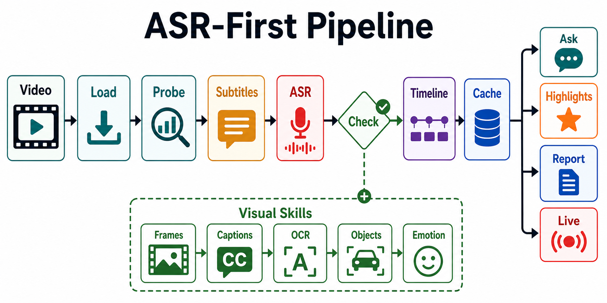

# Vidify

[English](README.md)

Vidify 是一个视频理解 Agent。输入 YouTube URL、HTTP 视频 URL 或本地视频，
即可得到结构化分析、可检索索引、问答、精彩片段、报告和实时流理解结果。



Vidify 采用分层结构组织：入口层、核心编排器、可组合工作流与 skills、模型适配器，
以及基于缓存的输出产物。

## 功能概览



| 能力 | 说明 |
|------|------|
| 分析 | 下载媒体、提取字幕和元数据、按需运行 ASR，并构建时间线 |
| 理解 | 帧描述、OCR、目标检测、情绪分析和转录翻译 |
| 搜索与问答 | 基于转录、帧和元数据构建 FAISS 索引，支持带证据的问答 |
| 剪辑 | 自动检测精彩片段，导出 clips，可选生成合集 |
| 实时流 | 处理摄像头、RTMP 或 HTTP 流，支持实时记忆和中途问答 |
| 工程化 | 支持重试、可选能力优雅降级、进度事件和生命周期 hooks |

Vidify 采用 ASR-first 设计：字幕和语音通常承载主要信息，因此当转录文本已经足够时，
会跳过昂贵的视觉模型调用。完整流程见 [Project Overview](docs/overview.md)。



## 2 分钟试用

```bash
pip install -e .
python -m agent.main analyze youtube "https://www.youtube.com/watch?v=..." --mode brief
```

示例输出结构：

```json
{
  "video": {
    "source": {"type": "youtube", "uri": "https://www.youtube.com/watch?v=..."},
    "duration_sec": 1234.5,
    "resolution": {"w": 1920, "h": 1080}
  },
  "timeline": {
    "chapters": [
      {"start": 0.0, "end": 120.3, "title": "...", "summary": "..."}
    ],
    "events": [
      {
        "start": 33.2,
        "end": 41.8,
        "text": "...",
        "evidence": {"asr_segment_ids": ["seg_12"], "frame_ids": ["f_0032"]}
      }
    ]
  },
  "asr": {
    "segments": [
      {"id": "seg_12", "start": 33.2, "end": 35.1, "text": "..."}
    ]
  }
}
```

## 快速开始

### 1. 安装

```bash
pip install -e .
```

系统依赖：Python 3.11+、`ffmpeg`、`yt-dlp`。

可选能力：

```bash
pip install -e ".[asr,ocr,emotion,live,serving]"
pip install -r requirements-full.txt
```

### 2. 配置

```bash
cp .env.example .env
```

如需自定义模型端点、模型名称、缓存路径或 Web 搜索凭证，请编辑 `.env`。
配置细节见 [Configuration](docs/configuration.md)。

### 3. 启动模型服务

Vidify 默认连接 OpenAI-compatible 多模态端点，通常使用 vLLM：

```bash
# Qwen3.5 需要 vLLM >= 0.19.0。
pip install "vllm>=0.19.0"

bash scripts/serving_qwen3_5.sh
```

手动启动示例：

```bash
vllm serve Qwen/Qwen3.5-9B \
  --host 0.0.0.0 --port 8000 \
  --max-model-len 65536 \
  --reasoning-parser qwen3 \
  --allowed-local-media-path $(pwd)/cache
```

GPU、Ascend/NPU、Docker 和验证命令见 [Deployment](docs/deployment.md)。

### 4. 运行

CLI：

```bash
python -m agent.main analyze youtube "https://www.youtube.com/watch?v=..." --mode detailed
python -m agent.main analyze local media/example.mp4 --mode brief
python -m agent.main analyze local media/example.mp4 --mode ask --question "What changed?"
```

REST API 和 Web UI：

```bash
uvicorn server.app:app --host 0.0.0.0 --port 9000

curl -X POST http://localhost:9000/analyze \
  -H 'Content-Type: application/json' \
  -d '{"source_type":"youtube","uri":"https://www.youtube.com/watch?v=...","mode":"detailed"}'
```

启动服务后打开 `http://localhost:9000` 使用 Web 界面。

## 工作流模式

`brief` 是标准轻量模式。CLI 和 API 仍接受 `quick` 作为旧别名。

| 模式 | 用途 | 示例 |
|------|------|------|
| `brief` | 快速 ASR-first 总结 | `python -m agent.main analyze youtube URL --mode brief` |
| `detailed` | OCR、目标检测、情绪、翻译和更完整时间线 | `python -m agent.main analyze youtube URL --mode detailed` |
| `ask` | 基于索引的视频问答 | `python -m agent.main analyze youtube URL --mode ask --question "What are the conclusions?"` |
| `highlights` | 导出精彩片段和可选合集 | `python -m agent.main analyze youtube URL --mode highlights` |
| `report` | 结构化报告，可选 Web 搜索增强 | `python -m agent.main analyze youtube URL --mode report --include-web-search` |
| `live` | 摄像头、RTMP 或 HTTP 实时流理解 | `python -m agent.main analyze local webcam --mode live` |

完整参数见 [Workflows](docs/workflows.md) 和 [API Reference](docs/api.md)。

## Hermes

仓库内置 Hermes skill：`.agents/skills/media/vidify`。

```bash
python -m agent.main hermes install-skill
```

默认会将 skill 以 symlink 方式安装到 `~/.hermes/skills/media/vidify`。
如果需要独立副本，可使用 `--strategy copy`。旧版 `openclaw/` skill 仍保留。

## 测试

运行快速测试：

```bash
pytest tests/
```

针对已有模型端点做验证：

```bash
bash scripts/run_test_gpu.sh --api-base http://localhost:8000/v1 --video media/my_video.mp4
python scripts/test_all.py --video-path media/my_video.mp4 --api-base http://localhost:8000/v1
```

更多测试、YouTube E2E 和硬件相关验证见 [Testing Guide](docs/testing.md)。

## 仓库结构

| 路径 | 作用 |
|------|------|
| `agent/core/` | 编排、schemas、事件、hooks、重试、分段和并行执行 |
| `agent/extensions/skills/` | 视频、音频、检索和分析能力单元 |
| `agent/extensions/workflows/` | 面向用户的工作流组合 |
| `agent/extensions/models/` | 模型适配和本地加载辅助 |
| `server/` | FastAPI app、SSE 端点和 Web routes |
| `templates/` | Web UI 模板 |
| `scripts/` | serving、验证和 demo 脚本 |
| `docs/` | 架构、工作流、部署和 API 文档 |
| `cache/` | 运行时产物，不应提交生成内容 |

## 文档

| 文档 | 内容 |
|------|------|
| [Project Overview](docs/overview.md) | ASR-first 设计、能力图谱和处理流程 |
| [Deployment](docs/deployment.md) | vLLM serving、GPU 验证、Ascend/NPU 辅助脚本和 Docker |
| [Live Streaming](docs/live-streaming.md) | 摄像头/实时流架构、CLI/API 用法和配置 |
| [Production Features](docs/production.md) | 重试、优雅降级、并行、进度事件、hooks 和日志 |
| [Architecture](docs/architecture.md) | 数据模型、缓存结构、模型接口和 orchestrator |
| [Workflows](docs/workflows.md) | brief、detailed、index、ask、highlights、report 和 live |
| [Skills Reference](docs/skills.md) | skill API 和职责 |
| [API Reference](docs/api.md) | REST 端点、CLI 参数、示例和 schemas |
| [Configuration](docs/configuration.md) | YAML 文件、环境变量、vLLM 设置和 Docker |
| [Testing Guide](docs/testing.md) | Pytest、本地 E2E、GPU/Ascend 端点验证和 YouTube E2E |
| [Web Search](docs/web-search.md) | Google Custom Search 和 fallback 搜索配置 |
